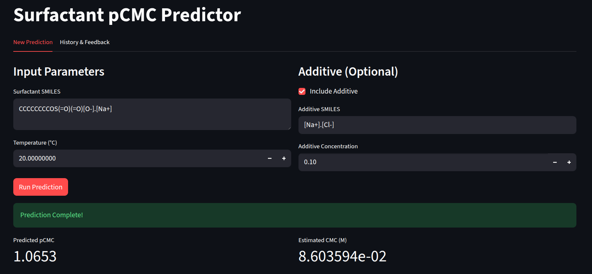

<p align="center">
  
</p>

# Predicting Critical Micelle Concentration (CMC) of Surfactants Using Machine Learning
Machine learning models that predict the critical micelle concentration (CMC) of surfactants from molecular structure and solution conditions (temperature, additive identity, and additive concentration). This repository contains the code, curated data, and trained model accompanying the paper *Conditional prediction and interpretation of surfactant CMC across molecular structure, temperature, and electrolyte environments* by Warbier-Wytykowska et al.

## Repository Structure

```
surfactants/
├── sources/                        # CSV datasets
│   ├── CMC_surfactants_v2_4.csv          # Expert-curated dataset (3,260 rows)
│   ├── CMC_surfactants_database_v2.csv   # Earlier version (used by transformer pipeline)
│   ├── Data_paper_1.csv                  # Chen et al. (2024) records
│   ├── Data_paper_4.csv                  # Brozos et al. (2024) records
│   └── lab.csv                           # External validation: 77 measured CMC values for 16 surfactants
│
├── cli/                            # Main ML pipeline (sklearn-based)
│   ├── __main__.py                       # CLI entry point
│   ├── commands/                         # Subcommands: train_test, cross_validate, predict, profile, pca
│   ├── datasets/                         # Dataset loaders (expert, paper1, paper4, lab, merged, example)
│   ├── features/                         # Feature extractors (30+ fingerprint types, Chen descriptors, expert features)
│   ├── models/                           # Model implementations (LGBM, Random Forest, KNN, Transformer, Dummy)
│   ├── data.py                           # Typed DataFrame definitions
│   ├── sample.py                         # Sample dataclass
│   ├── storage.py                        # Model storage paths
│   └── tools.py                          # Training, testing, cross-validation utilities
│
├── transformer/                    # Transformer-based pipeline (MoLFormer embeddings)
│   ├── main.py                           # Base transformer training script
│   ├── main_additives.py                 # Transformer with additive-aware features
│   ├── model_base.py                     # CMCRegressor (MoLFormer + temperature)
│   ├── model_additives.py                # CMCRegressorWithAdditives
│   ├── trainer.py                        # Training loop with early stopping
│   ├── normalize_df.py                   # Dataset loading and normalization
│   ├── utils_data.py                     # Dataset classes, scalers, collate functions
│   ├── utils_runtime.py                  # Reproducibility, device setup
│   ├── plotting.py                       # Training curves and validation scatter plots
│   └── processed_data/merged_data.csv    # Pre-merged dataset for transformer training
│
├── predictions/                    # Prediction results
│   └── prediction_history.csv            # Logged predictions from the Streamlit app
│
├── app.py                          # Streamlit web app for interactive pCMC prediction
├── lgbm-2026-01-08.pkl            # Pre-trained LGBM model (pickle)
├── requirements.txt               # Python dependencies
├── LICENSE                        # MIT License
└── .gitignore
```

## Requirements

- Python 3.13 (developed and tested on 3.13.13; the LGBM and Random Forest models work on Python 3.11+)
- The transformer model (`--model transformer`) requires `torch` and `transformers` to be installed
  separately and was originally developed with `transformers==4.46.3` on Python 3.11. Newer versions
  of `transformers` (5.x) may require additional dependencies (e.g. `torchvision`) and are not
  currently supported for the transformer model. Everything apart from the transformer model works
  on newer Python and library versions.
- ~2 GB of disk space if you use the MoLFormer-based models (the checkpoint is downloaded on first use)
- A GPU is optional; it is used automatically for the transformer models if available

```bash
git clone https://github.com/ashansaleha-collab/Surfactants-PUT.git
cd Surfactants-PUT
python -m venv .venv && source .venv/bin/activate   # Windows: .venv\Scripts\activate
pip install -r requirements.txt
```

> **Run every command from the repository root.** Dataset paths in the loaders are relative
> (`sources/...`), so commands executed from a subdirectory will fail to find the data.

## Quick start

Predict pCMC for cetyltrimethylammonium bromide (CTAB) at 25 °C, using the configuration
reported in the paper:

```bash
python -m cli predict \
  --model lgbm \
  --train everything \
  --features expert,chen,physiochemicalproperties \
  single -s "CCCCCCCCCCCCCCCC[N+](C)(C)C.[Br-]" -t 25.0
```

The command trains the model on the merged dataset and writes a prediction file to the working directory.

To predict a batch, put your samples in a CSV with the columns `surfactant_smiles, temperature, additive_smiles, additive_concentration, pcmc` (leaving `pcmc` empty for the rows you want predicted) and run:

```bash
python -m cli predict --model lgbm --train everything \
  --features expert,chen,physiochemicalproperties missing -f my_samples.csv
```

## Reproducing the results in the paper

| Paper item                                             | Command                                                                                                                                                                                                                                                          |
| ------------------------------------------------------ | ---------------------------------------------------------------------------------------------------------------------------------------------------------------------------------------------------------------------------------------------------------------- |
| Table I -- feature-set ablation (RF)                    | `python -m cli cross_validate --model rf --train everything --features expert` -- then repeat with `expert,maccs`, `expert,maccs,chen`, `expert,chen,physiochemicalproperties`, `expert,chen,avalon,bcut2d`, `expert,chen,avalon,bcut2d,physiochemicalproperties` |
| Table II -- model benchmark                             | `python -m cli cross_validate --model {lgbm,rf,transformer,knn} --train everything --features expert,chen,physiochemicalproperties`                                                                                                                              |
| Fig. 3 -- external validation on the laboratory dataset | `python -m cli train_test --model lgbm --train everything --test lab --features expert,chen,physiochemicalproperties --plot`                                                                                                                                     |

All models use `random_state=42`; cross-validation is 5-fold. Reported numbers are means over folds.

## Data

All data files live in `sources/`. The target is pCMC = -log10(CMC), CMC in mol/L.

| File                       | Rows  | Description                                                                                                                                                                                                                    |
| -------------------------- | ----- | ------------------------------------------------------------------------------------------------------------------------------------------------------------------------------------------------------------------------------ |
| `CMC_surfactants_v2_4.csv` | 3,260 | Expert-curated dataset: literature records standardised to canonical SMILES with head/tail annotations, surfactant class, molecular weight, additive, additive concentration, and temperature. Aggregates to 2,400 rows.        |
| `Data_paper_1.csv`         | 779   | Records from Chen et al. (2024).                                                                                                                                                                                               |
| `Data_paper_4.csv`         | 218   | Records from Brozos et al. (2024); note the target here is `log CMC (uM)`, converted on load.                                                                                                                                  |
| `lab.csv`                  | 77    | **External validation dataset:** 77 newly measured CMC values for 16 surfactants not present in the training data, used for Fig. 3 and Table III in the paper.                                                                  |

### How the training records are obtained

1. **Expert dataset** (`CMC_surfactants_v2_4.csv`, 3,260 raw rows) is loaded by the `expert` loader, which:
   - Drops rows with missing tail carbon number, molecular weight, or surfactant type (−260 rows)
   - Drops rows where additive is present but concentration is missing (−12 rows)
   - Aggregates duplicate measurements by SMILES + counterion + additive + concentration + temperature, averaging CMC/pCMC values (3,260 → **2,400 aggregated rows**)

2. **Paper 1** (`Data_paper_1.csv`, 779 rows) is loaded by the `paper1` loader as-is (779 rows).

3. **Paper 4** (`Data_paper_4.csv`, 218 rows) is loaded by the `paper4` loader as-is (218 rows).

4. The `everything` dataset concatenates all three and deduplicates: **2,400 + 779 + 218 = 3,397 raw rows**, aggregating to **3,272 rows**.

5. The `lab` dataset (`lab.csv`, 77 rows) is used as a held-out external validation set and is **not** included in the training data.

## Command-line interface

```
python -m cli <command> [options]
```

Shared options: `--model/-M`, `--features/-f` (comma-separated), `--param/-P key=value` (repeatable,
overrides model hyperparameters, e.g. `-P n_estimators=500`).

| Command          | Purpose                                        | Key options                                                                                                                             |
| ---------------- | ---------------------------------------------- | --------------------------------------------------------------------------------------------------------------------------------------- |
| `cross_validate` | 5-fold CV on one dataset                       | `--train`                                                                                                                               |
| `train_test`     | Train and/or evaluate                          | `--train`, `--test`, `--plot`. If both are the same dataset, an 80/20 split is used; if only `--test` is given, a saved model is loaded |
| `predict`        | Predict pCMC                                   | `single -s SMILES -t °C [-a ADDITIVE_SMILES -c CONC]` or `missing -f file.csv \| -d dataset`                                            |
| `profile`        | Ceteris-paribus response profile (temperature) | `-s SMILES [-a ADDITIVE -c CONC]`                                                                                                       |
| `pca`            | PCA of the feature space                       | `--train`, `--n-components`, `--color-by`, `--save-prefix`, `--no-standardize`                                                          |

**Models:** `lgbm`, `rf` (Random Forest), `knn`, `transformer` (MoLFormer + additives), `avg` and `dummy` (baselines).

**Datasets:** `expert`, `paper1`, `paper1_dedup`, `paper4`, `paper4_dedup`, `lab`, `everything`
(= `expert` + `paper1` + `paper4`), `example`. The `_dedup` variants remove surfactants that also
appear in the expert table, which is what you want when using them as held-out test sets.

**Feature extractors:** `expert` (molecular weight, surfactant class, tail carbon count), `chen`
(19 micellization-relevant descriptors after Chen et al.), and ~35 fingerprint and descriptor sets
from [scikit-fingerprints](https://github.com/scikit-fingerprints/scikit-fingerprints), including
`physiochemicalproperties`, `maccs`, `morgan`, `ecfp`, `rdkit`, `avalon`, `bcut2d`, `pubchem`,
`vsa`, `whim`. Run `python -m cli cross_validate --help` for the full list. Temperature and
additive concentration are always appended to the feature vector.


## Web app


```bash
streamlit run app.py
```

A single-page interface for entering a SMILES string, temperature, and optional additive, which
loads `lgbm-2026-01-08.pkl` and logs each prediction to `prediction_history.csv` in the working
directory. A public instance is available at: surfactants.cs.put.poznan.pl.

Note that the pickle stores a wrapper around a fitted scikit-learn pipeline, so it must be loaded
with a compatible environment (see `requirements.txt`) and from the repository root, where the
`cli` package is importable.


## Citing this work

```bibtex
@article{warmbier_wytykowska_cmc,
  title   = {Conditional prediction and interpretation of surfactant CMC across molecular
             structure, temperature, and electrolyte environments},
  author  = {Warmbier-Wytykowska, Ewelina and Sofiyan, Mohammed and Zygmanowski, Maciej
             and Di Maggio, Valerio and Mastrulli, Mario and Akib, Ananno
             and Pisaryk, Maryia and Różański, Jacek and Brzeziński, Dariusz},
  journal = {in review},
  year    = {2026}
}
```

## License

This project is licensed under the MIT License -- see the [LICENSE](LICENSE) file for details.

## Data sources

The training data were compiled from:

1. Chen, J., Hou, L., Nan, J., Ni, B., Dai, W., & Ge, X. (2024). Prediction of critical micelle
   concentration (CMC) of surfactants based on structural differentiation using machine learning.
   *Colloids and Surfaces A*, 703, 135276. https://doi.org/10.1016/j.colsurfa.2024.135276
2. Abooali, D., & Soleimani, R. (2023). Structure-based modeling of critical micelle concentration
   (CMC) of anionic surfactants in brine using intelligent methods. *Scientific Reports*, 13, 13361.
   https://doi.org/10.1038/s41598-023-40466-1
3. Moriarty, A., Kobayashi, T., Salvalaglio, M., Angeli, P., Striolo, A., & McRobbie, I. (2023).
   Analyzing the accuracy of critical micelle concentration predictions using deep learning.
   *Journal of Chemical Theory and Computation*, 19(20), 7371–7386.
   https://doi.org/10.1021/acs.jctc.3c00868
4. Brozos, C., Rittig, J. G., Bhattacharya, S., Akanny, E., Kohlmann, C., & Mitsos, A. (2024).
   Predicting the temperature dependence of surfactant CMCs using graph neural networks.
   *Journal of Chemical Theory and Computation*, 20(13), 5695–5707.
   https://doi.org/10.1021/acs.jctc.4c00314
5. Mukerjee, P., & Mysels, K. J. (1971). *Critical micelle concentrations of aqueous surfactant
   systems*. NSRDS-NBS 36.
